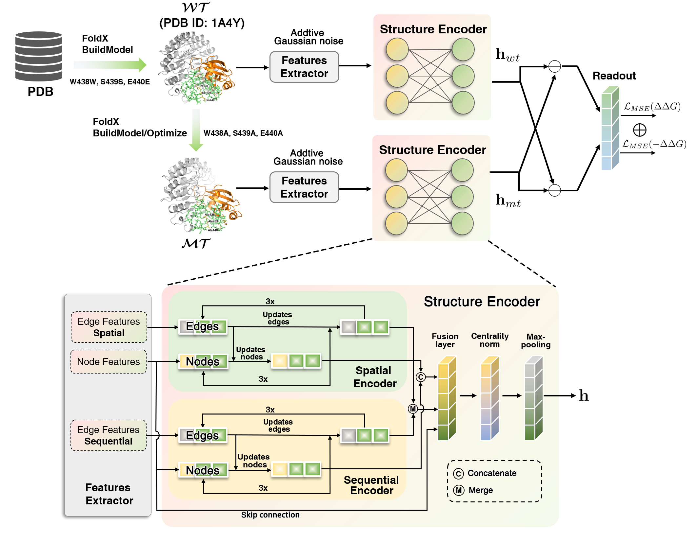

### DDAffinity-network

---

#### Description

This repo contains code for [Predicting the changes in binding affinity of multiple point mutations using protein three-dimensional structure](https://github.com/ak422/DDAffinity) by Guanglei Yu, Qichang Zhao, Xuehua Bi and Jianxin Wang.

We proposed a [ProteinMPNN](https://www.science.org/doi/10.1126/science.add2187)-inspired $\Delta\Delta G$ predictor using 3D structure and 2D sequences of wildtype $\mathcal{WT}$ and mutant $\mathcal{MT}$ protein complex as input. The mutant structure is generated by BuildModel and Optimize module using [FoldX 5.0](https://foldxsuite.crg.eu/). 

- **Clipped patches:** when given $\mathcal{WT}$ and $\mathcal{MT}$, we clipped $\mathcal{WT}$ and $\mathcal{MT}$ into residue patches containing 256 residues respectively, which are the 256 nearest neighbors of mutant residues based on $C_{\beta}$ distances of inter-residues, including the mutant residues itself. 
- **Two-step additive Gaussian noising strategy**: To improve the performance and generalization of DDAffinity, we implemented a two-step additive Gaussian noising strategy for the atomic coordinates of residues. Firstly,  the additive Gaussian noise ($std=0.2\mathring{\mathrm A}$) was combined with all input atomic coordinates, which yields the perturbed backbone dihedrals $(\phi,\psi,\omega)$ and sidechain dihedrals $(\chi^{(1)},\chi^{(2)},\chi^{(3)},\chi^{(4)})$. Secondly, inspired by the ideas of [ProteinMPNN](https://www.science.org/doi/10.1126/science.add2187) that can improve predictive performance and make prediction algorithm more robust, we also incorporate Gaussian noise ($std=0.2\mathring{\mathrm A}$) to the atomic coordinates of protein backbone atom set $\boldsymbol{A}=\{N,C_\alpha,C,O,C_\beta\}$. Importantly, this perturbation was implemented without updating the backbone dihedrals and sidechain dihedrals. Additionally, we only implemented above mentioned two-step additive Gaussian noising strategy during training.
- **How to construct the $k$-nearest neighbor graph**.  We use three different neighbor residues: (1) Spatial distance $k_1$. A residue will be connected to its $k_1$-nearest neighbors according to their spatial Euclidean distances, which ensures that the spatial densities of different proteins are comparable. (2) Sequential distance $k_2$. The linear interactions of residues are defined as the sequential distance between the residue $r_i$ and its sequence neighbors if their sequential distances are no more than $(k_2-1)/2$. (3) Long-range distance $k_3$. For efficiently capturing those dependencies that are long-range in sequence but local in 3D Euclidean space, neighbors of residue $r_i$ are ranked in ascending order according to their Euclidean distances, and discarded if their sequence distances are not greater than $(k_2-1)/2$. After that, we select the $k_3$-nearest neighbors from the ordered neighbor list. In summary, $k=k_1+k_2+k_3$.

Overview of our DDAffinity architecture is shown below.





## Install

#### DDAffinity Environment

```bash
conda env create -f env.yml -n DDAffinity
conda activate DDAffinity
```

The default PyTorch version is 1.12.1 and cudatoolkit version is 11.3. They can be changed in [`env.yml`](./env.yml).

## Preparation of processed dataset

We generated all protein mutant complex PDB data and wild-type complex PDB data from PDBs file [data/SKEMPI2/PDBs](https://drive.google.com/file/d/1SQTxpGr3P9hFhzmPCGIlAf0ggBSVoDVi/view?usp=drive_link), rde/datasets/PDB_generate.py, [data/SKEMPI2/SKEMPI2.csv](https://drive.google.com/file/d/15KHjAh_wIcoEbEmS5AHslewJHArgBvIc/view?usp=drive_link), and [FoldX](https://foldxsuite.crg.eu/) tool. Then we use rde/datasets/skempi_parallel.py to transform the PDB files of wild-type and mutant complexes into processed dataset [SKEMPI2_cache](https://drive.google.com/file/d/1p2ky9I8CwbCErGF0fw9jrAvrFkV95ZMe/view?usp=drive_link).

```bash
python PDB_generate.py 
python skempi_parallel.py --reset
```

#### Datasets

| Dataset                                                      |                  Download Script                   | Processed Dataset                                            |
| ------------------------------------------------------------ | :------------------------------------------------: | ------------------------------------------------------------ |
| [SKEMPI v2](https://life.bsc.es/pid/skempi2)                 | [`data/get_skempi_v2.sh`](./data/get_skempi_v2.sh) | [`data/SKEMPI2/SKEMPI2_cache`](https://drive.google.com/file/d/1p2ky9I8CwbCErGF0fw9jrAvrFkV95ZMe/view?usp=drive_link) |
| [SKEMPI2.csv](https://drive.google.com/file/d/15KHjAh_wIcoEbEmS5AHslewJHArgBvIc/view?usp=drive_link) |                         —                          | [SKEMPI2_cache](https://drive.google.com/file/d/1p2ky9I8CwbCErGF0fw9jrAvrFkV95ZMe/view?usp=drive_link) |
| [M1707.csv](https://drive.google.com/file/d/1JdXZ_DaYC0AusU6gpgQu0KWc-7W4ilf6/view?usp=drive_link) |                         —                          | —                                                            |
| [S1131.csv](https://drive.google.com/file/d/1yq8C2MVVBa51Zh1icwsM2cPWAE_Z_m9C/view?usp=drive_link) |                         —                          | —                                                            |
| [M1340.csv](https://drive.google.com/file/d/1dX_RUbxNg5NEp1QzEF7-YAqGn-vHiwJv/view?usp=drive_link) |                         —                          | —                                                            |
| [M595.csv](https://drive.google.com/file/d/1RarKcz3eya0gSHUX3C4xPtzLYnu3jbBH/view?usp=drive_link) |                         —                          | —                                                            |
| [S494.csv](https://drive.google.com/file/d/1DiFiYAoWZNP-x9YxfleBpa7WfUladeuY/view?usp=drive_link) |                         —                          | —                                                            |
| [S285.csv](https://drive.google.com/file/d/1BqHuKV35ybQZxO_PXzlwYlJhQcwZZGdv/view?usp=drive_link) |                         —                          | —                                                            |
| [Ssys.csv](https://drive.google.com/file/d/1_am6EKjYZjLXNcST-GmmYnPix2aX-DHf/view?usp=drive_link) |                         —                          | —                                                            |

### Trained Weights
The overall SKEMPI2 trained weights is located in:
[DDAffinity](https://drive.google.com/file/d/1tXCWe9M-vhporNHK04Lz-Gv479_nyoNL/view?usp=drive_link)

The M1340 trained weights is located in:
[M1340](https://drive.google.com/file/d/1UqcISgSUELdvoklX-UmDmvBA9RuDi5Mg/view?usp=drive_link)

### Usage

##### Evaluate DDAffinity

```bash
python test_DDAffinity.py ./configs/train/mpnn_ddg.yml --device cuda:0
```

#### Blind testing: non-redundant blind testing on the multiple point mutation dataset M595

```bash
python case_study.py ./configs/inference/blind_testing.yml --device cuda:0
```

#### Case Study 1: Predict Mutation Effects for SARS-CoV-2 RBD

```bash
python case_study.py ./configs/inference/case_study_1.yml --device cuda:0
```

#### Case Study 2: Human Antibody Optimization

```bash
python case_study.py ./configs/inference/case_study_2.yml --device cuda:0
```

#### Train DDAffinity

```bash
python train_DDAffinity.py ./configs/train/mpnn_ddg.yml --num_cvfolds 10 --device cuda:0
```
### Acknowledgements
We acknowledge that parts of our code is adapted from [Rotamer Density Estimator (RDE)](https://github.com/luost26/RDE-PPI). Thanks to the authors for sharing their codes. 

### Contact

---

Please check out our latest work CATH-ddG on mutational effect prediction for protein-protein interactions at [github](https://github.com/ak422/CATH-ddG)